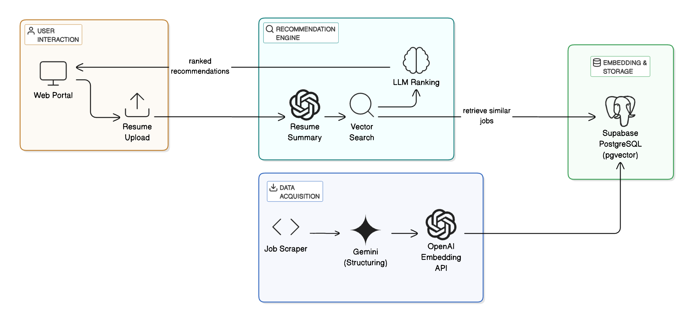

# chapchap
> https://chapchap.im 폐쇄

자세한 내용은 [이 블로그 글](https://rokrokss.com/post/2025/05/13/개발자-채용공고-추천-서비스-찹찹-chapchap.html)에서 확인할 수 있습니다.


## 주요 기능
 - 채용공고 수집과 정제: 정해진 몇 개 기업의 공식 채용페이지에서 개발자 공고를 수집하고 일정한 구조와 톤으로 변환하여 보여줍니다.
 - 이력서 기반 채용공고 추천: 이력서 혹은 간단한 자기소개 글을 입력하여 앞서 수집한 공고 중 가장 적합해보이는 공고들을 추천해줍니다.
 - AI 커버레터 생성: 추천된 채용공고 중 하나를 선택하면, 본인의 이력서와 해당 공고에 맞는 맞춤형 커버레터를 AI가 자동으로 생성해줍니다.

## 아키텍처



## 설치 및 실행

1. 프론트엔드

```bash
cd web
npm install
npm run dev
```

2. 백엔드
```bash
cd api
poetry install
make dev
```

3. 스크래퍼
```bash
cd scraper
poetry install
# 예시: 특정 사이트 크롤링
poetry run python daangn.py
```
